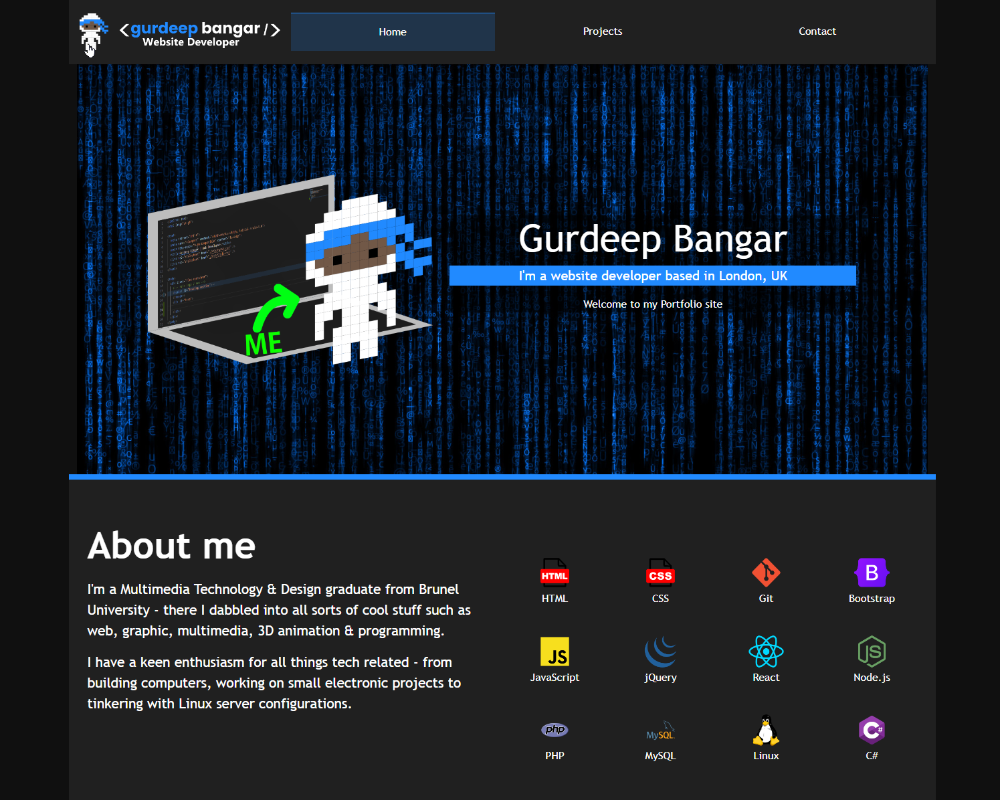

# React Portfolio 
## Description
An improved portfolio site created using React JS. Utilising React Router and components to render different pages and sections. 



[Click here to live demo](https://gurdeep-ninja.github.io/react-portfolio/)

## Table of Contents
[Installation](#installation)<br>
[License](#license)<br>
[Usage](#usage)<br>
[Notes](#notes)<br>
[Resources](#resources)<br>
[Questions](#questions)<br>
## Installation
To use this application, you must have ```node``` & ```npm``` installed.

To install, please make a clone of this repository to your local pc or web server.

Once you have cloned the repository, run the ```npm install``` command to download the project dependencies.
## Usage
To add extra projects to the portfolio section, first edit the file ```src\assets\json\projects.json``` and add a new object to the projects array.

Make sure you copy your project screenshot to the folder ```src\assets\images\``` directory.

Your new project will automatically appear in the projects section.

To change the hero project (first project), simply move the project object to the top of the projects array.

## License
This app uses the following license: GNU General Public License v3.0

## Notes
This project originally used the React ```Router``` but was swapped out to use ```HashRouter``` to resolve compatibility issues with deployment to GitHub pages. 

More information about the GitHub Router issue here: https://create-react-app.dev/docs/deployment/#notes-on-client-side-routing

## Resources

Getting Bootstrap Nav links to work with the React Router system (```src\components\Header\index.js```)

https://frontendshape.com/post/setup-bootstrap-5-navbar-in-reactjs-with-router

https://stackoverflow.com/a/54978470

How to create Bootstrap Alerts based on component state (```src\pages\Contact.jsx```)

https://www.pluralsight.com/guides/alert-users-to-errors-with-react-bootstrap

## Questions
If you have any questions or would like to get in touch, please see my contact details below.<br>
GitHub: [gurdeep-ninja](https://github.com/gurdeep-ninja)<br>
Email: [gurdeep.bangar@proton.me](mailto:gurdeep.bangar@proton.me)<br>

